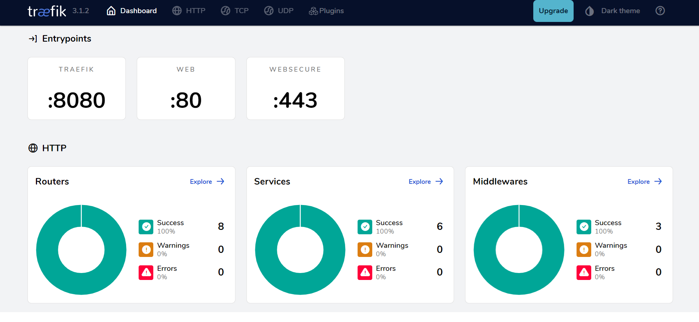

<h1 id="top" align="center">Micro <br/> Docker Config</h1> 

<br>

<div align="center">
    
</div>

## 🔍 Table of Contents

- [About Project](#intro)
- [Technologies](#technologies)
- [Features](#features)
- [Releases](#releases)
- [Treafik Dashboard](#traefik-dashboard)
- [System Links](#system-links)
- [System Preperation](#system-preperation)
- [System Startup](#system-startup)
- [Contributors](#contributors)
 
<br/>

<h2 id="intro">📌 About Project</h2> 

This project aims to design a microarchitecture that integrates client-side and server-side components, uses Docker for containerization, enforces TLS security protocols, and configures reverse proxies.

<br/>

<h2 id="technologies">☄️ Technologies</h2>

### DevOps

&nbsp; [](https://www.docker.com/)

&nbsp; [](https://traefik.io/)

### Web Server

&nbsp; [](https://www.nginx.com/)

&nbsp; [](https://tomcat.apache.org/)

### Build Tools

&nbsp; [](https://maven.apache.org/)

### Package Manager

&nbsp; [](https://www.npmjs.com/)

### Backend

&nbsp; [](https://www.java.com/)

&nbsp; [](https://spring.io/)

&nbsp; [](https://spring.io/projects/spring-boot)

&nbsp; [](https://swagger.io/)

&nbsp; [](https://jwt.io/)

### Frontend

&nbsp; [](https://react.dev/)

&nbsp; [](https://redux.js.org/)

&nbsp; [](https://mui.com/material-ui/)

&nbsp; [](https://www.typescriptlang.org/)

&nbsp; [](https://axios-http.com/)

&nbsp; [](https://vitejs.dev/)

&nbsp; [](https://eslint.org/)

&nbsp; 

&nbsp; [](https://www.ibm.com/docs/bg/aix/7.2?topic=files-env-file)

&nbsp; 

&nbsp; [](https://nodejs.org)

### Test

&nbsp; [](https://www.postman.com/)

<br/>

<h2 id="features">🔥 Features</h2>

### Micro Docker Config

+ **Centralized TLS Security:** Centralized TLS certificate configuration across all services.
+ **Auto-Renewal of Trusted TLS Certificates:** Automatic renewal of trusted TLS certificates to ensure uninterrupted security in production environments.
+ **Trusted TLS Certificates:** Secure communication between services using trusted SSL certificates managed by Traefik for production environment.
+ **Self-Signed TLS Certificates:** Secure communication between services using self-signed SSL certificates managed by Traefik for local development.
+ **Traefik Integration:** Traefik integrated for networking.
+ **Traefik Load Balancing:** Load balancing configured through Traefik for improved scalability and also local service development.
+ **Traefik Router:** Routing configured through Traefik for service communication without exposing port to public.
+ **Traefik Dashboard:** Dashboard integrated for monitoring and managing Traefik services, routers and prefixes.
+ **Docker-Compose Configuration:** Comprehensive Docker-Compose configuration for managing service orchestration.

### Micro Frontend

+ **Custom Modal:** Includes a custom modal component with configurable actions to enhance user interaction.
+ **Global State Management:** Redux implementation for consistent state handling across the application.
+ **Persistent Data:** Language, theme mode, and theme schema are stored in localStorage.
+ **Internationalization:** Language support with i18n for a multilingual user experience.
+ **Custom Scrollbar Design:** Custom scrollbar styling to match the application's aesthetic.
+ **Floating Action Button:** A "Go to Top" button for improved navigation.
+ **Multi-Message Snackbar:** Support for displaying multiple snackbars using notistack.
+ **Professional UI/UX:** Modern user interface and experience.
+ **Input Validation:** Enhanced validation support for user inputs.
+ **Dark/Light Theme Mode:** Toggle between dark and light modes.
+ **Theme Schema Customization:** Toggle between default and custom theme schema.
+ **Custom Theme:** Added support for custom themes.
+ **Responsive Design:** Optimized for different screen sizes and devices.
+ **Material-UI Integration:** Extensive use of Material-UI components.
+ **Environment Variables:** Support for environment variables to manage configurations.
+ **Dockerization:** The application is containerized for consistent deployment and scaling.

### Micro Backend

+ **Postman Endpoint Collection:** Postman collection added for ensure validation of all API endpoints.
+ **Swagger Documentation:** Comprehensive API documentation integrated for documentation and testing purposes.
+ **Environment Configuration:** Configurations have been adjusted for enhanced flexibility.
+ **Dockerization:** The application is containerized for consistent deployment and scaling.

### Micro Email Service

+ **Postman Endpoint Collection:** Postman collection added for ensure validation of all API endpoints.
+ **Swagger Documentation:** Comprehensive API documentation integrated for documentation and testing purposes.
+ **Environment Configuration:** Configurations have been adjusted for enhanced flexibility.
+ **Dockerization:** The application is containerized for consistent deployment and scaling.

<br/>

<h2 id="releases">🚢 Releases</h2> 

&nbsp; [](https://github.com/ahmettoguz/Micro-Docker-Config/tree/release/3.1.0)

&nbsp; [](https://github.com/ahmettoguz/Micro-Docker-Config/tree/deploy-v1)

&nbsp; [](https://github.com/ahmettoguz/Micro-Docker-Config/tree/deploy-v2)

&nbsp; [](https://github.com/ahmettoguz/Micro-Docker-Config/tree/release/3.0.1)

&nbsp; [](https://github.com/ahmettoguz/Micro-Docker-Config/tree/release/3.0.0)

&nbsp; [](https://github.com/ahmettoguz/Micro-Docker-Config/tree/release/2.0.0)

&nbsp; [](https://github.com/ahmettoguz/Micro-Docker-Config/tree/release/1.1.0)

&nbsp; [](https://github.com/ahmettoguz/Micro-Docker-Config/tree/release/1.0.0)

<br/>

<h2 id="traefik-dashboard">🚥 Traefik Dashboard</h2> 
Monitor and manage services through the Traefik dashboard.

To view the dashboard visit: [`traefik`](https://sendsphere.com.tr/traefik/dashboard/#/).



<br/>

<h2 id="system-links">🔗 System Links</h2> 

| Service            | URL                                                        |
|--------------------|------------------------------------------------------------|
| Frontend           | https://sendsphere.com.tr/                                 |
| Traefik Dashboard  | https://sendsphere.com.tr/traefik/dashboard/#/             |
| Backend Swagger UI | https://sendsphere.com.tr/backend/sw/swagger-ui/index.html |
| Email Swagger UI   | https://sendsphere.com.tr/email/sw/swagger-ui/index.html   |

<br/>

<h2 id="system-preperation">🔧 System Preperation</h2>

<br/>

<h3 id="developer-mode">🧪 Developer Mode</h3>

#### Micro Docker Config

* Update the domain name in the `traefik-conf/traefik-dynamic.yml` file, replacing current domain name with your domain name such as localhost.
* Place email address to `traefik-conf/treafik.yml`.

<br/>

#### Micro Frontend

* To change system configs such as endpoint urls, modify `.env` file.
  
<br/>

#### Micro Email Service

* Place credentials in the `application-dev.properties` file.

<br/>

<h3 id="production-mode">⚡Production Mode</h3> 

#### Micro Docker Config

* Obtain a domain name.
* Update the domain name in the `traefik-conf/traefik-dynamic.yml` file, replacing current domain name with your domain.
* Place email address to `traefik-conf/treafik.yml`.
* Change permission of the `/crt/acme.json` file with `chmod 600`.

<br/>

#### Micro Frontend

* To change system configs such as endpoint urls, modify `.env` file.

<br/>

#### Micro Backend

* Copy `application-dev.properties` to create `application-prod.properties`.
* Change `app.var.appMode` to `prod`.
* Change `server.port` to `80`.
  
<br/>

#### Micro Email Service

* Go to your Google Account settings at [`myaccount.google.com`](https://myaccount.google.com/).
* In the navigation panel, select [`Security`](https://myaccount.google.com/security).
* Under `How you sign in to Google`, select `2-Step Verification`.
* Add your phone number as a verification method.
* Go to  [`myaccount.google.com/u/1/apppasswords`](https://myaccount.google.com/u/1/apppasswords) and generate a new app password.
* Copy `application-dev.properties` to create `application-prod.properties`.
* Change `app.var.appMode` to `prod`.
* Change `server.port` to `80`.
* Place credentials.

<br/>

<h2 id="system-startup">🚀 System Startup</h2> 

```
docker compose -p micro down
docker compose -p micro up -d --build

docker compose -p micro down reverse-proxy
docker compose -p micro up -d reverse-proxy --build

docker compose -p micro down frontend
docker compose -p micro up -d frontend --build

docker compose -p micro down backend
docker compose -p micro up -d backend --build

docker compose -p micro down email-service
docker compose -p micro up -d email-service --build

docker compose ls
```

<br/>

<h2 id="contributors">👥 Contributors</h2> 

<a href="https://github.com/ahmettoguz" target="_blank"></a> 

### [🔝](#top)
